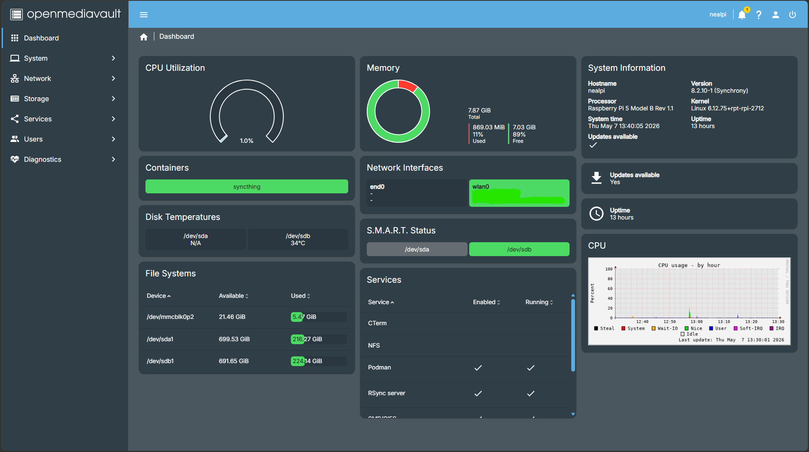
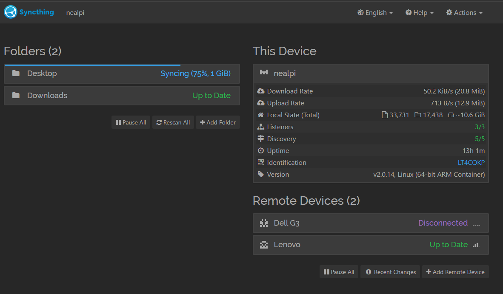
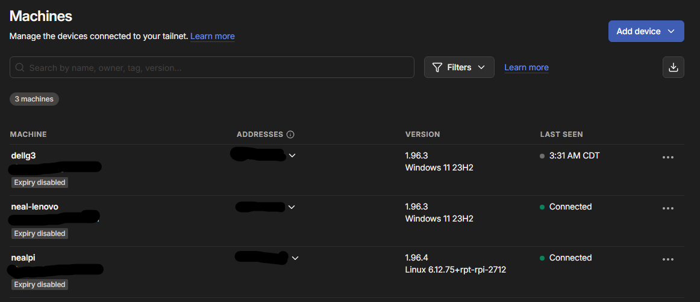
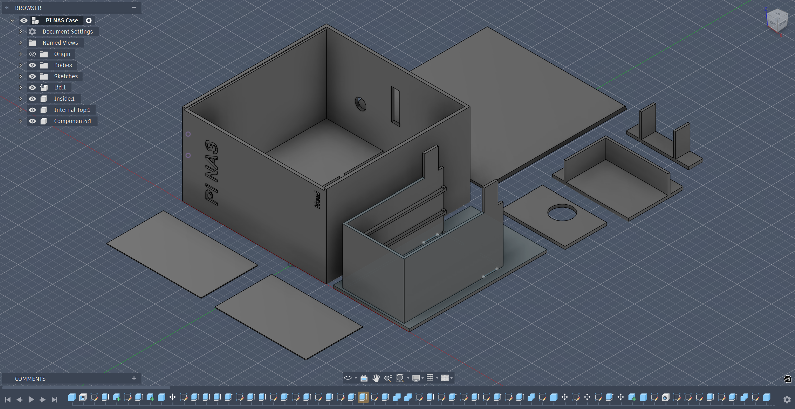
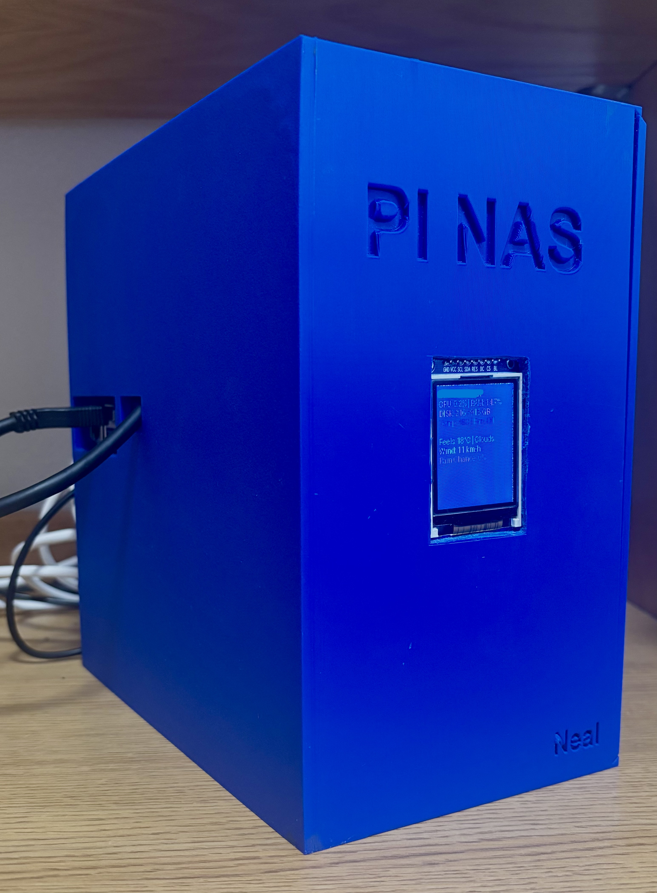
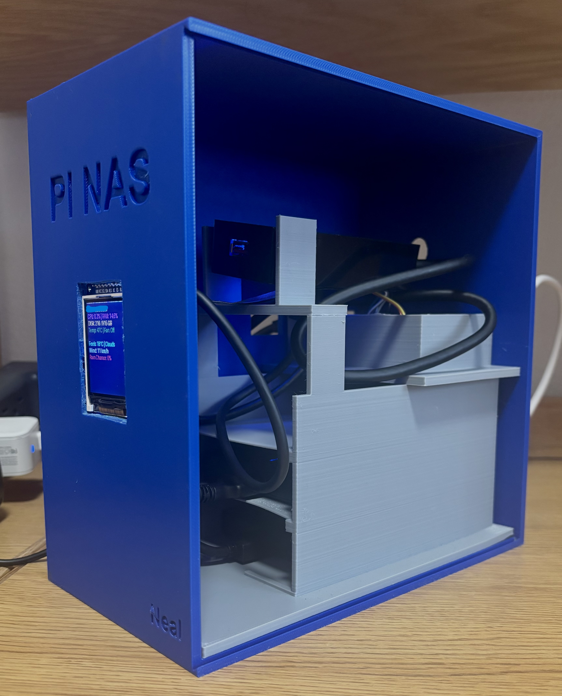

# Raspberry Pi 5 Network Attached Storage

A self-hosted Raspberry Pi 5 NAS built with OpenMediaVault, Tailscale, Syncthing, scavenged laptop drives, and a custom GPIO display.

I built this because I was tired of paying for cloud storage. I already had old laptop drives sitting around, so I figured: why keep renting storage when I can build my own?

What started as a cheap NAS idea turned into a full self-hosted setup for file sharing, syncing, remote access, backups, health alerts, containers, and a small status screen built into the system.

Basically: my own mini cloud, but sitting on my desk and fully under my control.

---

## Images

| Open Media Vault | Syncthing |
|---|---|
|  |  |

| Tailscale | 3D Model |
|---|---|
|  |  |

| Case | Inside |
|---|---|
|  |  |

---

## Why I Built This

The main reason was simple: I did not want to keep paying for cloud storage.

I had a couple of old 1 TB laptop drives, and instead of letting them sit unused, I wanted to turn them into something useful. A Raspberry Pi NAS made sense because it is small, low power, customizable, and good enough for home file storage and syncing.

The best part is that I control the whole setup. I decide where the files live, how they are shared, how they are backed up, what services run, and how remote access works.

This project also gave me a reason to mess with Linux, networking, storage, self-hosting, 3D printing, and custom hardware all in one build and was a great learning experience.

---

## Hardware

Core hardware used in the build:

- Raspberry Pi 5, 8 GB model
- 32 GB microSD card for the OS
- 2 × 1 TB laptop hard drives scavenged from old laptops
- Powered USB hub for the drives
- USB-C charger for the Pi
- Raspberry Pi heatsink and fan
- 4-inch GPIO screen
- Custom 3D printed case

The drives are powered through a powered USB hub because running multiple laptop drives directly from the PI is not possible due to power constraints. The Pi handles the actual NAS services, while the hub gives the drives stable power.

---

## Software Stack

The NAS runs a lightweight Debian-based Raspberry Pi OS setup with OpenMediaVault installed on top.

Main software:

- **OpenMediaVault** for managing storage, users, shares, and alerts
- **SMB Share** for file sharing between Windows computers and the NAS
- **Tailscale** for secure remote access without port forwarding
- **Syncthing** for syncing files between my computers and the Pi
- **Docker and Podman** for containers and future self-hosted services
- **Custom Python display script** for the GPIO screen
- **Email alerts** for system and storage health notifications

---

## How It Works

OpenMediaVault manages the hard drives and shared folders. My computers connect to those folders over SMB, so the NAS feels like a normal network drive.

Tailscale handles remote access. Instead of opening ports on my router, my devices connect through a private Tailscale network. That means I can reach the NAS away from home without exposing SMB or the OMV dashboard directly to the internet.

Syncthing keeps files synced between my PCs and the Pi. It gives me cloud-like syncing, but the data stays on hardware I own. I also use version history and backup folders so deleted or changed files can be recovered later.

The GPIO display gives the NAS a physical dashboard. I can glance at the device and see useful system info without opening a browser or SSH session.

---

## File Sharing

SMB is used so both computers can access shared folders from the NAS like regular network drives.

This makes the Pi the central storage point for the setup. Instead of files being scattered across machines, the NAS holds the shared data and both computers can access it.

---

## Remote Access

Tailscale is what makes the NAS usable from anywhere.

It creates a private network between my devices, so I can access the NAS remotely without opening public ports or exposing services directly to the internet.

This is useful for:

- Accessing files away from home
- Letting Syncthing sync remotely
- Managing the NAS when I am not on the local network
- Keeping the setup private and simple

---

## Syncing and Backups

Syncthing is an open-source software which is used to sync files between my two PCs and the Pi.

The goal is to get the convenience of cloud sync while keeping everything on my own hardware. The Pi acts as the always-on sync point, and the other computers can stay in sync through it.

The setup is meant to support:

- Automatic file syncing
- File version history
- Weekly backups
- Monthly backups
- Recovery if something gets deleted or overwritten

---

## Custom GPIO Display

One of the extra parts of the build is a 4-inch GPIO screen attached to the Pi.

The display runs a custom Python script that shows useful system information directly on the NAS. It makes the build feel more like a real device instead of just a headless Pi sitting on the network.

The dashboard can show things like:

- IP address
- CPU usage
- RAM usage
- Disk usage
- Temperature
- Fan status
- Weather/status info

The display also has a keyboard-triggered terminal mode. When a USB keyboard is plugged in, the screen switches from the dashboard to a simple terminal. When the keyboard is unplugged, it returns to the dashboard.

This gives the NAS a lot more flexibility because I do not need to connect a full monitor just to interact with the Pi. If the Pi is online, I can use Raspberry Pi Connect or SSH through the web. But if the Pi is offline or having network issues, the built-in screen and keyboard mode still give me a way to access it directly.

This was one of the more interesting parts of the project because Linux input devices can change depending on what is plugged in. The script had to be updated so it detects the real keyboard instead of a different IO.

---

## 3D Printed Case

The NAS is set up in a custom 3D printed case.

The goal was to make the build feel like a finished device instead of a Pi, drives, hub, and cables sitting loose on a desk. The case holds the Pi, supports airflow, helps with cable management, and makes the screen look like a part of the build.

You can find the model file in this repository.

---

## Reliability Choices

A few choices were made to make this setup more stable:

- Use a powered USB hub for the hard drives
- Keep the OS on the SD card and data on separate drives
- Use UUID-based drive mounts instead of relying on `/dev/sda` or `/dev/sdb`
- Use Tailscale instead of exposing services directly to the internet
- Use Syncthing versioning for recovery
- Enable email alerts for drive or service problems
- Add a physical display for quick status checks

This is still a home project, not an enterprise server, but these choices make it much more dependable for daily use.

---